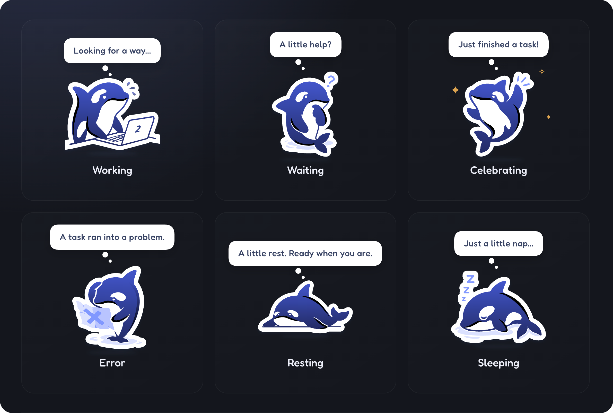

# Whale Companion

**Your little whale buddy for work, wins, and well-earned naps.**



*Character state overview. Whale stickers are original artwork by DeepSeek.*

A little companion that lives inside your DeepSeek Harness (DSH) window—there while you work, wait, and rest.

一只住在 DSH 窗口里的小鲸鱼。陪你工作、等你决定，也陪你好好打个盹。

> **Local diagnostic build: 0.2.8-beta.2 — not published to npm.** Compatibility target: DSH Desktop 0.1.6-alpha.2. This build adds a privacy-safe **Sync diagnostics** menu and fixes a reproduced local Remote-registration retry defect. It does not establish that the installed missing-celebration issue is solved. See the [diagnostic guide](DIAGNOSTICS.md).

Install this diagnostic build using the provided `dsh-plugin-whale-pet-0.2.8-beta.2.tgz` local package after current tasks finish. The npm/GitHub installation links below still refer to the previously published beta.1, not this local diagnostic build.

## Features

- Drag, resize, hide, and restore your whale inside the DSH window.
- Choose **All sessions** or **Current session**, with a working-session count for ordinary main sessions.
- Six character states: resting, working, waiting, celebrating, sleeping, and error.
- English and Chinese text, light and dark settings menus, and reduced-motion support.
- Separate normal completion from cancellation and failure; a falling working count or green unread indicator alone does not mean success.

This is an in-window plugin, not a separate operating-system desktop overlay.

## Install the beta

### 1. npm package — available now

Package page: [dsh-plugin-whale-pet on npm](https://www.npmjs.com/package/dsh-plugin-whale-pet).

Enter this pinned version in DSH's plugin installation interface:

```text
dsh-plugin-whale-pet@0.2.8-beta.1
```

You can also use `dsh-plugin-whale-pet@beta` to follow the beta channel. This is a prerelease, not a stable-release certification.

### 2. GitHub — available now

Enter this pinned version spec in DSH's plugin installation interface:

```text
github:Yifffan/dsh-plugin-whale-pet#v0.2.8-beta.1
```

The tagged source snapshot includes prebuilt plugin files; users do not need to build it themselves.

### 3. Download a local package — available now

[Download dsh-plugin-whale-pet-0.2.8-beta.1.tgz](https://registry.npmjs.org/dsh-plugin-whale-pet/-/dsh-plugin-whale-pet-0.2.8-beta.1.tgz)

This download is hosted by the npm registry. Download the tgz onto the machine running DSH and enter its absolute local path in DSH's plugin installation interface. GitHub's automatically generated “Source code” archives are not plugin tgz packages.

**Upgrading from 0.2.6 or earlier? Read the [upgrade notes](UPGRADE.md) first.** Overrides for the old entry ID do not migrate automatically. Do not replace the plugin or restart DSH while tasks are running. This plugin never automatically edits your profile.

If host modules need reloading after installation or activation, wait for current tasks to finish, fully quit DSH, and reopen it. Closing a window may not quit the application. Restarting is not a guaranteed fix for the known celebration issue.

## Usage

- **Click** the whale to say hello; **drag** it to reposition.
- **Right-click** to change session scope, size, animation, and nap timing.
- Use the restore button to bring back a hidden whale.
- Global scope covers ordinary main sessions on the currently connected Host—not multiple devices or Hosts.
- Waiting for user input has higher display priority. Brief completion notices are not queued for later replay.

## Known issues and verification limits

1. **Celebration may not appear in the installed app.** Current-session and global modes share the completion stream, and both have reports of missed celebrations. The cause has not been isolated to connection, event filtering, or display priority.
2. **Historical entry-ID change.** Since 0.2.7, the entry ID is `whale-pet`; the module name remains `dsh-plugin-whale-pet`. Older overrides require migration.
3. DSH is still in alpha, and plugin interfaces may change. Other DSH versions and operating-system combinations are not certified.
4. The offline preview deliberately simulates completion. It validates rendering and state transitions, not delivery of real session events.

See [compatibility and verification boundaries](COMPATIBILITY.md). When [reporting an issue](https://github.com/Yifffan/dsh-plugin-whale-pet/issues), include DSH/plugin versions, session scope, and reproduction steps. Remove chat content, session identifiers, and other sensitive information.

## Development and local preview

Use Node.js 22 or newer and the pnpm version pinned in the project manifest.

```sh
pnpm install --frozen-lockfile
pnpm run build
pnpm test
```

The build regenerates the bridge contract and client, then creates an offline preview. Open this generated local file in a browser; no web server is needed:

```text
preview/index.html
```

The preview does not connect to DSH or call a model. Its generic chevron is independently drawn; the production interface uses DSH's public icon component.

```sh
# After a successful build and test run, create a local plugin package:
pnpm pack --pack-destination artifacts
```

The package declares no installation lifecycle hooks to build code, migrate profiles, or download a runtime. Building and testing are explicit development steps. Prebuilt files are committed for Git installation; rebuild after source changes and commit matching outputs.

Fonts are bundled, so ordinary builds do not download them. New Chinese bubble text requires a glyph-coverage check; the first public snapshot does not include font-resubsetting tools. See [font sources and licenses](FONT-LICENSES.md).

## Privacy and runtime boundaries

- Does not modify DSH itself, send model messages, add model inference calls, or act on approvals for you.
- Uses DSH's existing authenticated connection. No additional listening port, telemetry, or runtime font/CDN requests.
- The completion bridge projects only necessary session identity and turn-boundary metadata—not chat content.
- Preferences stay in client-local storage. Tests use synthetic data. This repository contains no user profiles, session records, or extracted DSH implementation code.

## Artwork and project notice

The whale stickers used by this plugin are original artwork by DeepSeek. All related rights belong to DeepSeek or the respective rights holders. The artwork is not covered by this project's MIT code license.

This is a personal project, not an official DeepSeek product. It does not represent DeepSeek's official views or endorsement.

This project has permission to use and distribute the artwork in this repository and its published plugin packages. That permission does not automatically extend to third parties extracting, modifying, or redistributing the artwork.

- **Code:** [MIT License](LICENSE).
- **Whale artwork:** [artwork permission notice](ASSETS-LICENSE.md), separate from the MIT code license.
- **Fonts:** [SIL OFL 1.1 and source notices](FONT-LICENSES.md).
- **Zod:** its MIT copyright and license notice are preserved in the generated bridge files.

Permission to reuse the code is not permission to freely extract or redistribute the whale artwork.
